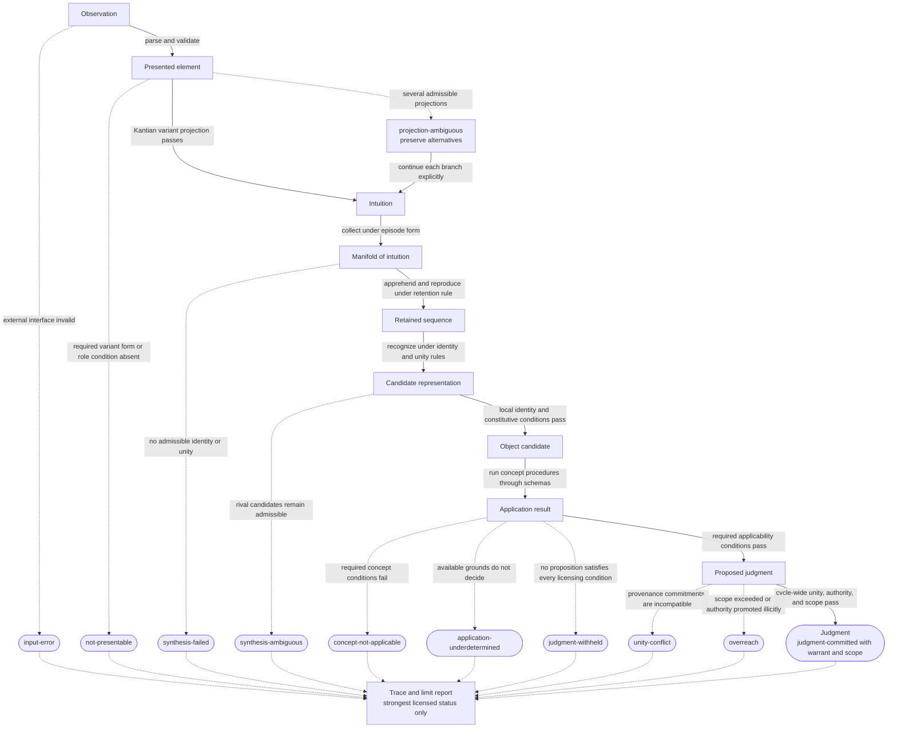
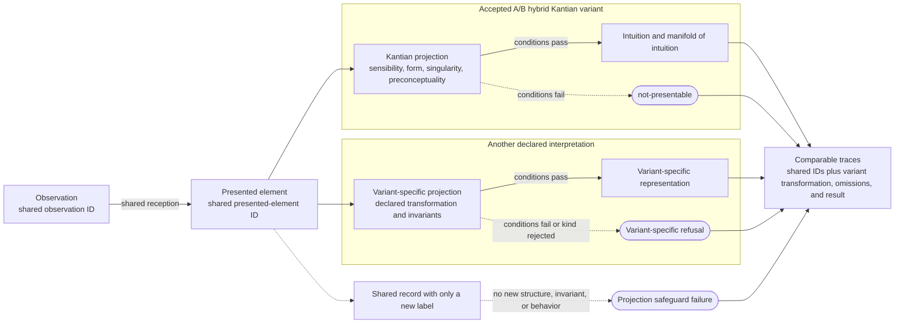
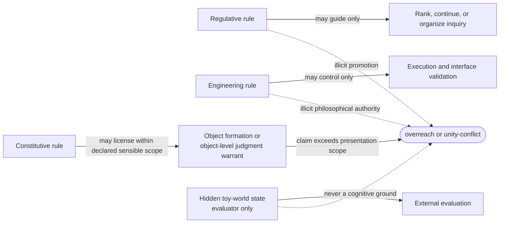

# Cognitive Architecture: Component Boundaries and Transformations

## Status and purpose

This document is the diagrammatic companion to the
[philosophical specification](PHILOSOPHICAL_SPECIFICATION.md). It shows the
semantic components, ownership boundaries, representation changes, licensing
gates, and typed limit paths required by the accepted Phase 1 decisions. It
does not define Phase 2 data structures, APIs, processes, or deployment units.
The [hand-worked traces](WORKED_EXAMPLES.md) instantiate these paths in a
concrete toy world, and the
[behavioral-prediction catalog](BEHAVIORAL_PREDICTIONS.md) states how their
causal differences must appear in controlled comparisons.

The diagrams are normative where they restate the specification and
[ADRs 0001–0004](docs/decisions/README.md#index). Their role boundaries are
formalized by the Phase 2
[callable interfaces](ROLE_INTERFACES.md#boundary-map); their layout is only
explanatory. If a diagram appears to conflict with an accepted decision or the
prose licensing conditions, the decision record and prose condition govern.

## Reading conventions

| Notation | Meaning |
| --- | --- |
| Solid arrow | A representation or result is transformed into the next representation or result |
| Dashed arrow | A rule, constraint, comparison identity, or cross-cutting check governs another component |
| Component box | A semantic cognitive or engineering role, not necessarily a class, module, process, or agent |
| Representation box | A state whose grounds and transformation provenance remain inspectable |
| Rounded outcome | A typed terminal status; stopping a cognitive path is still a successful model output |

Every derived representation carries links to its immediate grounds, the
transformation and rule used, alternatives, unmet conditions, scope, and rule
authority. The diagrams abbreviate those links as a shared provenance graph;
they do not permit a stage to emit an ungrounded value.

## 1. System and interpretation boundaries

The first boundary separates serialized input handling from cognition. The
second separates vocabulary shared by every interpretation from the selected
variant's theory-internal representations. This implements
[ADR 0001](docs/decisions/0001-variant-scoped-receptive-terminology.md): an
`intuition` must be the result of a substantive Kantian projection, not a new
label placed on a shared record.

```mermaid
flowchart LR
    subgraph EXT["External interface — outside cognitive roles"]
        SRC["Finite toy-world episode"]
        OBS["Observation"]
        PARSE["Parser and validator"]
        SRC -->|serialize with source, order, and quality| OBS
        OBS -->|validate interface only| PARSE
    end

    subgraph SHARED["Shared comparison boundary"]
        RECEIVE["Shared reception"]
        PE["Presented element"]
        RECEIVE -->|presented: admit content and preserve identity| PE
    end

    subgraph VARIANT["Selected interpretation variant"]
        CONFIG["Frozen cycle configuration"]
        PROJECT["Variant projection"]
        RECEPTIVE["Variant-specific receptive representation"]
        CYCLE["Cognitive cycle"]
        PROJECT -->|projected: add or validate variant conditions| RECEPTIVE
        RECEPTIVE -->|make available under declared form| CYCLE
        CONFIG -.->|form, variant, rules, and scope| PROJECT
        CONFIG -.->|one configuration governs all stages| CYCLE
    end

    PARSE -->|valid observation| RECEIVE
    PE -->|same shared identity enters a declared projection| PROJECT
    PARSE -.->|invalid serialization| INPUT_ERROR(["input-error"])
    PROJECT -.->|required form or role condition absent| NOT_PRESENTABLE(["not-presentable"])

    CYCLE --> RESULT["Scoped judgment or strongest licensed non-judgment"]
    CYCLE --> TRACE["Provenance graph and limit report"]

    subgraph DEFERRED["Represented but inactive in the first cycle"]
        REASON["Reason — inference chains and systematic inquiry deferred to Phase 4"]
    end
    TRACE -.->|reserves authority and provenance fields| REASON
```

For the accepted A/B hybrid Kantian variant, `PROJECT` is the sensibility role,
the receptive representation is an `intuition`, and its bounded plurality is a
`manifold of intuition`. A competing variant shares observations and presented-
element identities but owns its projection criteria and vocabulary. Temporal
form is required by the accepted variant; spatial form is required only when a
scenario's object rules depend on spatial relations.

## 2. Cognitive-role ownership

The faculty names identify constrained functions. They do not imply separate
agents, consciousness, or one software service per faculty. In particular,
imagination executes synthesis over sensible content while understanding owns
or constrains the rules used there. The dashed edges make that deliberate
shared boundary visible, following
[ADR 0002](docs/decisions/0002-a-b-synthesis.md).

```mermaid
flowchart LR
    subgraph RECEPTION["Reception boundary"]
        SENS["Sensibility<br/>project under sensible form"]
        MAN["Intuition and<br/>manifold of intuition"]
        SENS -->|produce| MAN
    end

    subgraph SYNTHESIS["One imagination-led synthesis boundary"]
        APPREHEND["Apprehension<br/>traverse and take together"]
        REPRODUCE["Reproduction<br/>retain under an explicit rule"]
        RECOGNIZE["Recognition<br/>propose unity under identity"]
        CAND["Candidate representation"]
        APPREHEND --> REPRODUCE --> RECOGNIZE -->|yield one or more| CAND
    end

    OBJECT["Object candidate"]

    subgraph RULES["Discursive rule ownership"]
        UNDERSTAND["Understanding"]
        CONCEPTS["Concepts and constitutive rules"]
        UNDERSTAND -->|owns| CONCEPTS
    end

    CONFIG["Frozen cycle configuration<br/>form, variant, retention, schemas, authority, scope"]

    subgraph APPLICABILITY["Applicability boundary"]
        JUDGE["Power of judgment"]
        SCHEMAS["Schema-mediated tests"]
        APPLICATION["Application result"]
        JUDGE -->|runs| SCHEMAS -->|satisfied, failed, undecided| APPLICATION
    end

    subgraph COMMITMENT["Commitment boundary"]
        PROPOSE["Judgment proposal"]
        PROPOSITION["Proposed judgment"]
        UNITY["Apperception<br/>cycle-wide unity check"]
        COMMIT["Commit or withhold"]
        PROPOSE --> PROPOSITION --> UNITY --> COMMIT
    end

    MAN --> APPREHEND
    CAND -->|local identity and constitutive conditions pass| OBJECT
    OBJECT --> JUDGE
    APPLICATION -->|assemble only from passing required grounds| PROPOSE

    CONFIG -.->|sensible form| SENS
    CONFIG -.->|retention rule| REPRODUCE
    CONFIG -.->|schemas and sensible conditions| JUDGE
    CONFIG -.->|rule authority and scope| PROPOSE
    CONFIG -.->|one cycle and configuration| UNITY
    CONCEPTS -.->|identity, unity, persistence, succession| RECOGNIZE
    CONCEPTS -.->|constitutive conditions| OBJECT
    CONCEPTS -.->|general applicability conditions| JUDGE
    CONCEPTS -.->|predicate conditions| PROPOSE

    PROVENANCE["Provenance graph<br/>all grounds, alternatives, and authorities"]
    MAN -.-> PROVENANCE
    CAND -.-> PROVENANCE
    OBJECT -.-> PROVENANCE
    APPLICATION -.-> PROVENANCE
    PROPOSITION -.-> PROVENANCE
    PROVENANCE -.->|entire subgraph, not only the proposition| UNITY

    COMMIT -->|all required conditions pass| JUDGMENT(["judgment-committed<br/>with warrant and scope"])
    COMMIT -.->|one or more conditions remain unmet| LIMIT(["typed limit or<br/>judgment-withheld"])
    JUDGMENT --> CRITIQUE["Critique and reporting"]
    LIMIT --> CRITIQUE
    PROVENANCE --> CRITIQUE
    CRITIQUE --> REPORTED["Terminal result with provenance,<br/>alternatives, scope, and limits"]
```

A B-led synthesis policy may compress apprehension, reproduction, and
recognition into a figurative-synthesis stage. It must still preserve reception,
retention and combination grounds, objective-unity constraints, sensible-use
limits, and comparable trace evidence; compression is not permission to erase
the work performed by a boundary.

The ownership boundary can be read as the following contract:

| Role | Owns | Consumes | Produces | Must not do |
| --- | --- | --- | --- | --- |
| Parser and validator | External interface correctness | Serialized observations | Valid observations or `input-error` | Synthesize, apply concepts, or infer objecthood |
| Shared reception | Minimal cross-variant admission and identity | Valid observations | Presented elements | Add a variant-specific cognitive status |
| Sensibility | Kantian variant projection and sensible form | Presented elements and cycle configuration | Intuitions, manifold, ambiguity, or `not-presentable` | Identify objects or apply concepts |
| Imagination | Apprehension, licensed reproduction, and recognition | Manifold plus supplied rules | Retained sequences and candidate representations | Treat unrestricted retrieval, clustering, or concatenation as synthesis |
| Understanding | Concepts and constitutive rules | Frozen concept and rule repertoire | Constraints supplied to synthesis, applicability, and proposal | Receive raw observations or declare its concepts applicable |
| Power of judgment | Schema-mediated applicability | Candidates, concepts, schemas, and sensible conditions | Satisfied, failed, and undecided application conditions | Turn application directly into commitment |
| Apperception | Cycle-wide unity and scope constraint | Proposed judgment and complete provenance subgraph | Unity success or `unity-conflict` | Simulate a self or repair incompatible grounds silently |
| Critique and reporting | Terminal status, scope, alternatives, and limits | Every terminal path and its provenance | Warranted judgment or typed non-judgment | Invent missing grounds or hidden noumenal explanations |
| Reason | No active first-cycle operation | Reserved authority and provenance fields only | Nothing in the first cycle | Add inference chains or systematic goals before Phase 4 |

## 3. Representation transformations and licensing gates

This is the default A-analysis/B-constraint path chosen in
[ADR 0002](docs/decisions/0002-a-b-synthesis.md). A solid path indicates that
the next representation is licensed; a dashed branch preserves a typed limit
or alternative rather than silently coercing it into the success path.

The apparent linearity is not a permission to erase alternatives. Concept
application or the unity check may request a recorded return to an earlier
candidate, but the new branch must retain the earlier candidate, failed grounds,
and reason for revision. Repetition cannot turn failure into warrant.

[ADR 0003](docs/decisions/0003-object-and-judgment-licensing.md) fixes three
separate gates that a classifier would commonly collapse:

1. **Object formation:** identity and constitutive-unity rules license an
   object candidate.
2. **Applicability:** a schema or another inspectable procedure determines
   whether a concept applies to that candidate.
3. **Commitment:** the proposed proposition and all of its grounds pass the
   cycle-wide unity, scope, and authority check.

A successful application can therefore end in `judgment-withheld`, and a
coherent object candidate can remain without an applicable predicate.

## 4. Cross-variant comparison

Every variant begins with the same observation and presented-element identity,
then performs its own substantive projection. The trace is comparable because
it preserves the shared identity; the cognitive representations need not be
the same. A refusal is a legitimate variant result.

This boundary lets the Kantian variant make a strong theory-internal claim
without imposing its ontology on every later critique. It also makes a merely
decorative vocabulary change observable as a failed implementation of the
projection contract.

## 5. Rule authority and limit enforcement

Rule authority constrains what a successful computation may license. A rule's
output does not acquire object-level authority merely because the operation ran
without error. This is the boundary fixed by
[ADR 0004](docs/decisions/0004-limit-outcomes-and-rule-authority.md).

Uncertainty, ambiguity, failure, withholding, and overreach remain distinct:
uncertainty qualifies support within an admissible path; ambiguity preserves
several admissible paths; failure names a violated condition; withholding
refuses commitment; and overreach identifies an illicit scope or authority
change. Hidden scenario state may score a result but cannot repair its warrant.

## Phase 2 handoff constraints

The formal model may choose different implementation structures, but it must
preserve these observable boundaries:

- external validation does not perform cognition;
- shared reception and variant projection remain distinct;
- synthesis changes the available unity of the manifold and retains
  alternatives and provenance;
- concepts and schemas remain distinct from their application results;
- object formation, applicability, and judgment commitment remain separate
  gates;
- apperception checks the complete provenance graph rather than only the final
  proposition;
- rule authority constrains what outputs can license; and
- every terminal path yields a typed outcome, trace, scope, and limit report.

These constraints are semantic. Phase 2 may combine storage or execution
mechanisms only when the resulting traces still expose every distinction above.
