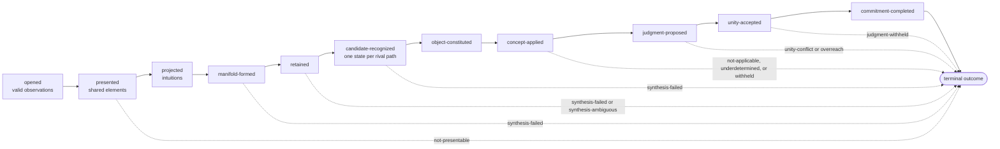

# State-Transition Model for One Cognitive Cycle

## Status and scope

This document maps the specified cognitive flow to the immutable snapshots and
pure transition functions in
[`kantbot.transitions`](src/kantbot/transitions.py). It completes the third
Phase 2 Roadmap item. The model orders the accepted role interfaces and checks
their cross-stage results; it does not implement any cognitive algorithm, build
the complete provenance graph, or perform input/output.

**Engineering.** The transition order is derived from the
[philosophical specification](PHILOSOPHICAL_SPECIFICATION.md#the-cognitive-flow),
the [role contracts](ROLE_INTERFACES.md), and accepted ADRs
[0002–0004 and 0006](docs/decisions/README.md#index). It does not settle a new
interpretive dispute. In particular, it preserves the already accepted
separation of object formation, applicability, proposal, unity, and
commitment.

## Requirements and assumptions

One path through a cycle must:

- keep one frozen cycle identifier, scope, episode, and configuration;
- accept only immutable canonical values returned at the proper role boundary;
- make every strengthening of cognitive status a named transition;
- expose a cognitive failure as one of the ten typed terminal outcomes, never
  as an exception or a fabricated weaker success;
- allow rival candidates to become separate paths without erasing their mutual
  alternative relation; and
- remain deterministic, side-effect-free, serializable, and readable without
  requiring a state-machine framework.

A path begins only after external data has become valid `Observation` values.
`input-error` therefore terminates at the input-validation boundary rather than
entering reception. A cycle may contain several active paths after recognition;
they share `cycle_id` and `RoleContext`, while their candidate and application
values remain distinct.

## State and data flow

Each box below is a distinct tagged Pydantic state. A transition receives the
state on its left and a result from the corresponding callable role, validates
their identities and context, and returns a new box. It never mutates either
input.

The `CycleState` discriminated union contains all snapshots. `CycleTerminated`
adds the operation boundary at which its outcome became the strongest licensed
result. This prevents, for example, a `judgment-committed` value from being
reported as though it arose directly from application.

Snapshots carry only the strongest current artifact rather than nesting the
entire history. Earlier artifacts remain connected by their typed derivation
references. This avoids duplicating a provenance graph as a tree; the next
Roadmap item will resolve and validate that graph.

## Legal transitions

| Current state | Supplied role result | Next state or terminal result |
| --- | --- | --- |
| External validation | `InputError` | `input-error` at input validation |
| `CycleOpened` | Complete tuple of `PresentedElement` | `ReceptionCompleted` |
| `ReceptionCompleted` | Complete tuple of `Intuition` | `ProjectionCompleted` |
| `ReceptionCompleted` | `NotPresentable` | `not-presentable` |
| `ProjectionCompleted` | `ManifoldOfIntuition` containing exactly those intuitions | `ManifoldFormed` |
| `ManifoldFormed` | `RetainedSequence` | `RetentionCompleted` |
| `ManifoldFormed` | `SynthesisFailed` | `synthesis-failed` at retention |
| `RetentionCompleted` | One or more `CandidateRepresentation` values | One `CandidateRecognized` path per candidate |
| `RetentionCompleted` | `SynthesisFailed` or `SynthesisAmbiguous` | Matching terminal outcome at recognition |
| `CandidateRecognized` | `ObjectCandidate` | `ObjectConstituted` |
| `CandidateRecognized` | `SynthesisFailed` | `synthesis-failed` at object formation |
| `ObjectConstituted` | `ApplicationResult` | `ConceptApplied` regardless of application status |
| `ConceptApplied` | Matching application limit | `concept-not-applicable` or `application-underdetermined` |
| `ConceptApplied` | `ProposedJudgment` grounded in an applicable result | `JudgmentProposed` |
| One or more applicable paths | `JudgmentWithheld` preserving all application IDs | `judgment-withheld` at proposal |
| `JudgmentProposed` | Passing `UnityCheck` | `UnityAccepted` |
| `JudgmentProposed` | `UnityConflict` or `Overreach` | Matching terminal outcome at unity |
| `UnityAccepted` | `CommittedJudgment` using that unity check | `CommitmentCompleted` |
| `UnityAccepted` | `JudgmentWithheld` preserving the proposal | `judgment-withheld` at commitment |
| `CommitmentCompleted` | Matching `JudgmentCommitted` | `judgment-committed` after critique |

`record_recognition` has two explicit treatments of alternatives. It can stop
with `synthesis-ambiguous`, or it can return several candidate states for the
branch-relative continuation illustrated by
[Worked Example Trace 5](WORKED_EXAMPLES.md#trace-5). Continued rivals must name
one another as alternatives. `withhold_rival_applications` later converges such
successful paths only as `judgment-withheld` unless some declared constitutive
ground licenses a singular subject.

## Invalid transitions versus cognitive limits

`InvalidTransition` means the program attempted an incoherent composition: an
application names another object, a manifold silently drops an intuition, a
proposal cites another application, or a result crosses scope or configuration
boundaries. It is a programming or trace-integrity error.

A well-formed cognitive refusal is different. `not-presentable`, synthesis
failure or ambiguity, failed or undecided application, unity conflict,
withholding, and overreach are ordinary immutable return values. Transition
functions preserve them in `CycleTerminated`; they do not raise them as
exceptions.

This layer checks only facts available from adjacent states. Complete
reachability, semantic-ID resolution, authority flow, and evaluator-state
exclusion require the structured provenance validator in the next Roadmap
item.

## Trade-offs and later revision

**Engineering.** Explicit state classes and named functions repeat some fields,
but make the licensing gates visible to readers and to mypy. A generic
`advance(stage, payload)` function would be shorter while allowing more illegal
combinations to reach runtime. An external state-machine library would add a
second vocabulary without improving this small, deterministic graph.

The current legal graph is acyclic. The specification permits a future concept
application or unity policy to request a return to a narrowed candidate, but
the accepted role-result unions do not yet define a revision value. Adding an
untyped loop now would allow alternatives to disappear. Revisit the graph when
a concrete variant needs revision: introduce a typed revision record that
names its prior candidate, abandoned alternatives, reason, and derivation, then
test that repetition cannot manufacture warrant.

Likewise, if later cycles run concurrently or persist incrementally, revisit
the in-memory path snapshots and serialization boundary. Storage, scheduling,
retry, and distributed coordination are deliberately outside this formal
model.

## Verification

Runtime tests execute the complete committed path, every terminal boundary,
recognition fan-out, rival-application withholding, context rejection, and
state JSON round trips. [`typechecks/cycle_transitions.py`](typechecks/cycle_transitions.py)
is a static witness that the successful path composes only after each union has
been narrowed to its legal next state. Ruff, strict mypy, branch coverage, and
SonarQube remain the shared repository checks.
